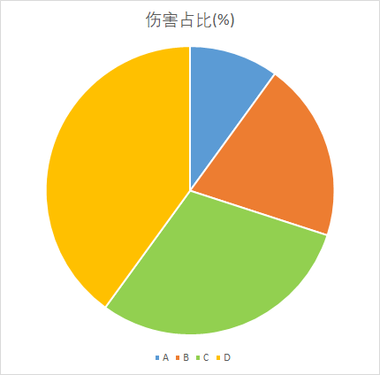

# PACK 打包抽取模式

## 配置项

| 配置项 | 含义 |
| :----: | :----: |
| LootAction | 被选中的玩家将得到的奖励 |
| GuaranteeAction | 未被选中的玩家将得到的奖励 |

## 模式简介

本模式下, 所有奖励将作为一个整体, 按照玩家造成的伤害权重进行抽取

假设共有A、B、C、D四名玩家对目标怪物造成过伤害

玩家A伤害占比10%

玩家B伤害占比20%

玩家C伤害占比30%

玩家D伤害占比40%

以饼状图表示如下:



将饼状图视作标靶, PACK模式的处理方式可以理解为向标靶投掷1次飞镖(红叉表示飞镖落点), 被射中的玩家获得奖励


如图所示, 可以很清晰地得到结论:

玩家A伤害占比10%, 10%几率获得奖励

玩家B伤害占比20%, 20%几率获得奖励

玩家C伤害占比30%, 30%几率获得奖励

玩家D伤害占比40%, 40%几率获得奖励

本次玩家A中标, 即, 玩家A将得到`LootAction`配置下的所有奖励

玩家B、C、D将得到`GuaranteeAction`配置下的所有奖励(未配置`GuaranteeAction`则无奖励)

## 配置示例

```yaml
PACK模式怪物示例:
  Type: ZOMBIE
  Health: 1
  Banker:
    test1:
      LootType: PACK
      LootAction:
      - 'tell: 恭喜中奖! 你的伤害占比为<fastcalc::<damage>/<totalDamage>*100_1>%'
      GuaranteeAction:
      - 'tell: 很遗憾, 你没有获得奖励. 你的伤害占比为<fastcalc::<damage>/<totalDamage>*100_1>%'
```
