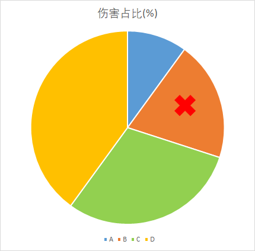
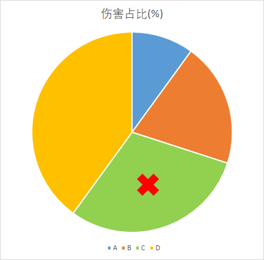

# SEPARATE 拆分抽取模式

## 配置项

| 配置项 | 含义 |
| :----: | :----: |
| LootAction | 待选奖池 |
| GuaranteeAction | 什么都没抽中的玩家得到的奖励 |

## 模式简介

SEPARATE模式下, LootAction中的一条条配置将被视为一条条待选奖励

每条奖励都会按照玩家造成的伤害权重抽取中奖玩家, 示例配置如下:

```yaml
SEPARATE模式怪物示例:
  Type: ZOMBIE
  Health: 1
  Banker:
    test1:
      LootType: SEPARATE
      LootAction:
      # 第一条配置
      - 'tell: 你抽到了奖励1'
      # 第二条配置
      - condition: perm("奖励2")
        actions:
        - 'tell: 你抽到了奖励2'
        deny:
        - 'tell: 虽然你抽到了奖励2, 但是非常可惜, 你没有"奖励2"权限'
      # 第三条配置
      - 'tell: 你抽到了奖励3'
```

与PACK模式类似, 

假设共有A、B、C、D四名玩家对目标怪物造成过伤害

玩家A伤害占比10%

玩家B伤害占比20%

玩家C伤害占比30%

玩家D伤害占比40%

以饼状图表示如下:


将饼状图视作标靶, SEPARATE模式的处理方式可以理解为不停向标靶投掷飞镖(红叉表示飞镖落点), 每次中标的玩家获得对应奖励






如图所示, 可以很清晰地得到结论, 每次奖励抽取中:

玩家A伤害占比10%, 10%几率获得奖励

玩家B伤害占比20%, 20%几率获得奖励

玩家C伤害占比30%, 30%几率获得奖励

玩家D伤害占比40%, 40%几率获得奖励

图中我们分别抽中了玩家A、玩家B和玩家C, 所以玩家A将获得第一条奖励, 玩家B将获得第二条奖励, 玩家C将获得第三条奖励

玩家D什么都没抽中, 将得到`GuaranteeAction`配置下的所有奖励(未配置`GuaranteeAction`则无奖励)

## 私有参数

在公有参数的基础上, SEPARATE模式还提供以下私有参数:

| 参数名 | 含义 |
| :----: | :----: |
| lootAmount | 奖励总数 |

## 配置示例

动作写法详见[NeigeItems动作](战利品配置/公有参数.md#neigeitems动作)

```yaml
SEPARATE模式怪物示例:
  Type: ZOMBIE
  Health: 1
  Banker:
    test1:
      LootType: SEPARATE
      LootAction:
      - 'tell: 你抽到了奖励1'
      - condition: perm("奖励2")
        actions:
        - 'tell: 你抽到了奖励2'
        deny:
        - 'tell: 虽然你抽到了奖励2, 但是非常可惜, 你没有"奖励2"权限'
      - 'tell: 你抽到了奖励3'
      GuaranteeAction:
      - 'tell: 一共有 <lootAmount> 条奖励, 可你毛都没抽到.'
```
